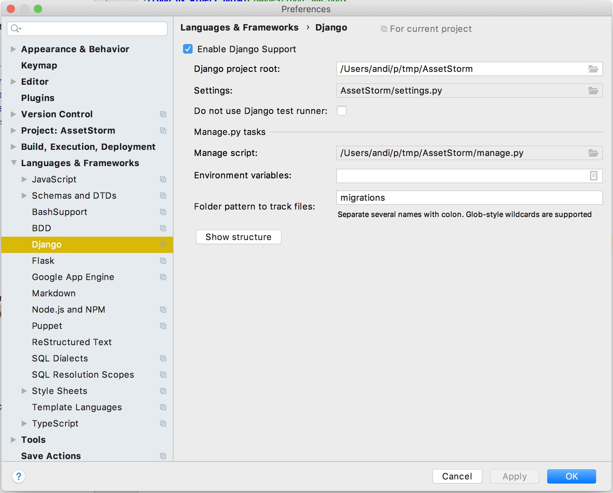

# AssetStorm


AssetStorm lets you save data with your preferred schemas in a 
PostgreSQL database. This can be used for publications like magazines
or websites but also for a lot of other things.

There is no frontend included with AssetStorm. It just exposes its 
[API](https://github.com/pinae/AssetStorm/blob/master/AssetStormAPI.yaml).

## Development setup
On Ubuntu install `postgresql` and `libpq-dev`.

After that create a virtual environment and install the requirements:
```shell script
make build
```

After that start the postgres server and create an account and a 
database for development:

```shell script
docker-compose up 
```

We run `docker-compose` in foreground to be able to see all SQL queries.


### Tests

To run the tests in terminal, call: 

```shell script
make test
```

To run and debug tests in PyCharm, you need to have PyCharms Django settings
configured properly. 


